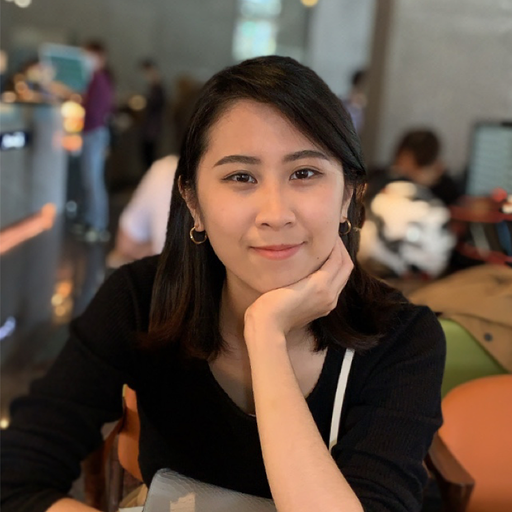

  

# **I am Sherry**
A junior web backend engineer who likes to learn about new technologies and cats. 😸

## **A little about myself..**
I came from a art/sales background and have made a career shift to web development just few months ago. I hope to inspire those who are still hesitant of giving themselves a chance to get into tech, because I've received so much love and support along this journey into the programming world.

## **Tech stack**
- **FE**: HTML, CSS, JavaScript, React.js, Bootstrap, TailwindCSS
- **BE**: NodeJS, MySQL, MariaDB, Redis, MongoDB, Heroku, Netlify, Docker
- **Collaboration**: Git & GitHub, Gitlab, Trello, Slack

In this Hexo-blog I will be sharing my notes on the skills I learn, technical discussions, leedcode solutions, reflections on my career as a backend engineer, and recordings of my side projects.

You can reach me at my [LinkedIn](https://www.linkedin.com/in/sherrycliao/), [Medium](https://icaughtacode.medium.com/), [GitHub](https://github.com/sherryliao21), and [Email](mailto:sherry.c.liao+hexo.gmail.com)


  console.log('Hello World!')


